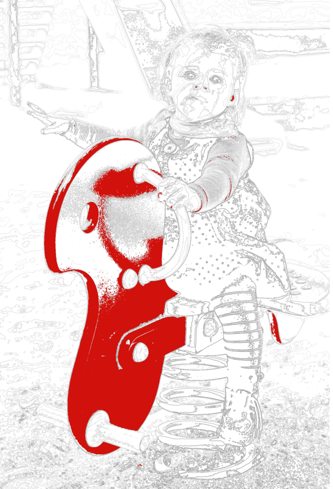

# colorbynumbers

Creates color by numbers pics from a master picture. 
Several things such as the number of clusters shall be given in the code. 
There is definetaly room for improvement, code could be written better as well, it is only a prrof of concept. 
Example of master Pic: 

couple of regions as output:

